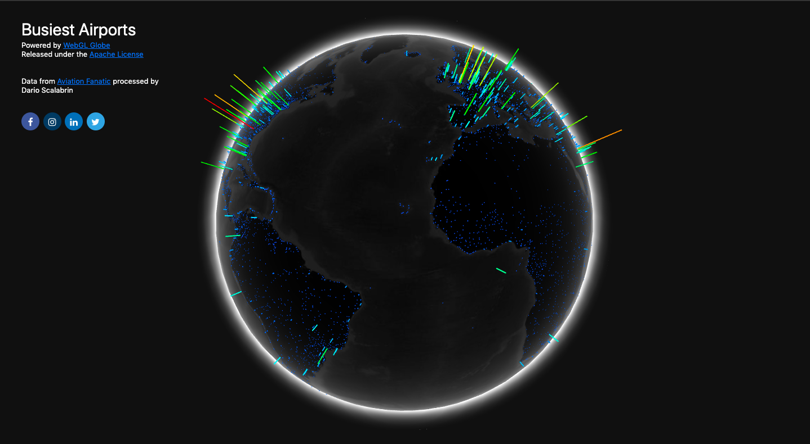

# Webgl Globe

I needed a cool data visualization in order to represent the busiest airport of 2018, and I want to share with all of you.<br> You can easily see in live to <a href="https://busiest-airport-2018.netlify.com/">this link</a>.



## Assumption

Special thanks for the data to <a href="https://www.aviationfanatic.com/">Aviaiton Fanatic</a>.<br>
This is a open source project and you can easily do the same going <a href="https://experiments.withgoogle.com/chrome/globe">here</a>


## Data 

If you want to recreate the same thing, you should change the file apt.json. in this way <br>
```
var data = [[value, latitude, longitude],[value, latitude, longitude]...]
```
<b>Important remark:</b> The ```value``` has to be include in the range 0 and 1, so you have to scale your numbers in order to visualize correct the graph.

## Visualization  

I suggest you to register in this <a href="https://netlify.com">website</a>, and upload all the files in that service provider. 
